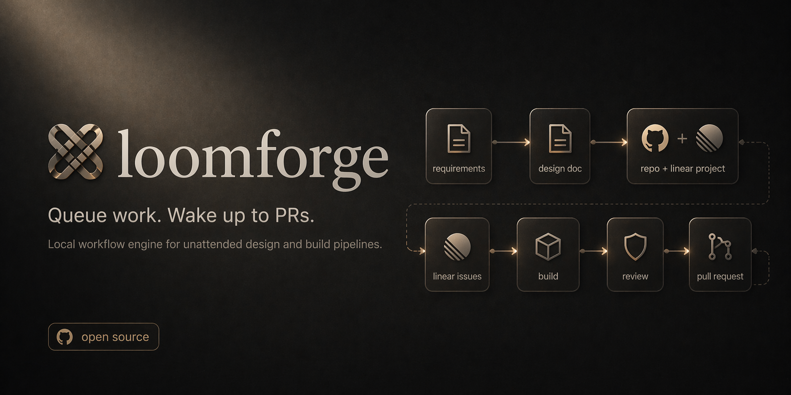

<p align="center">
  
</p>

A local workflow engine that takes you from idea to merged PR, unattended.
Two pipelines: a **design flow** (requirements → scaffolded repo + Linear
project + design doc) and a **build flow** (Linear issue → code → review → PR).

---

## Table of Contents

- [What It Does](#what-it-does)
- [Why](#why)
- [Prerequisites](#prerequisites)
- [Quick Start (npm)](#quick-start-npm)
- [Install from Source](#install-from-source)
- [Configuration](#configuration)
- [Usage](#usage)
  - [Issue build flow](#issue-build-flow)
  - [Ad-hoc run](#ad-hoc-run)
  - [Design flow](#design-flow)
  - [Reloading project config](#reloading-project-config)
- [MCP Server (optional)](#mcp-server-optional)
- [Development](#development)
- [Testing](#testing)
- [Architecture](#architecture)
- [Contributing](#contributing)
- [Security](#security)
- [License](#license)

---

## What It Does

Loomforge runs two complementary pipelines, both unattended:

**Design flow.** Write a one-page requirements doc and run
`loomforge design new <slug>`. Loomforge scaffolds a Git repo (locally and on
GitHub), drafts a structured design doc, has a reviewer agent critique it,
revises once, then publishes the doc as a Linear project plus a design
document. You review the design and break it into Linear issues — that human
checkpoint is deliberate.

**Build flow.** Point Loomforge at a Linear project. It fetches actionable
issues, spins up a builder agent (Codex or Claude) to write the code, runs a
reviewer agent to check it, applies one round of fixes if needed, pushes to a
`dev` branch, and opens a pull request describing what shipped. You review and
merge — Loomforge handles everything before that.

**Designed for:** solo developers and small teams who want overnight or
batch-mode design + build cycles, without running a heavyweight platform.

---

## Why

I've been running an overnight build pipeline since the early days of OpenClaw.
After brainstorming designs with OpenClaw and Claude during the day, a nightly
cron job would pick up the Linear issues, use Claude to build and Codex to
review, and move issues to Done by morning. It worked - until it didn't.
Breaking changes in Claude's tool use, instability in OpenClaw's ACP protocol,
and fragile skill wiring meant the workflow would silently break every few
weeks. I looked at Paperclip, but it carries too much weight - multi-tenant,
Postgres, plugin marketplace — for what is fundamentally a single-developer
overnight build loop. Loomforge is the lighter, purpose-built replacement:
same pipeline, fewer moving parts, easy to fix when something changes.

The design half was the natural sibling. The same brainstorming with OpenClaw
that produced the issues also needed a repo and a published design doc — work
I was doing by hand at 11pm. Loomforge's design flow runs the same agents over
a one-page requirements doc and produces the scaffolding, the Linear project,
and the design doc. I still create the issues by hand — that review point
stays — and then the build flow takes over.

---

## Prerequisites

- **Node 22+**
- **[Codex CLI](https://github.com/openai/codex)** and/or **[Claude Code CLI](https://claude.ai/claude-code)** — builder and reviewer runners (configurable per project)
- **[Linear API key](https://linear.app/settings/api)** — issue fetching and status sync

---

## Quick Start (npm)

```sh
npm install -g @tezra-io/loomforge
```

The installer scaffolds `~/.loomforge/` with default config files and attempts
to register the daemon (launchd on macOS, systemd on Linux).

Then run the interactive setup:

```sh
loomforge setup
```

This validates your config, installs the agent skill (prompts you to choose
target agents), and prints next steps.

After setup, configure your Linear API key and add a project
(see [Configuration](#configuration)).

---

## Install from Source

For contributors or users who prefer to build from source.

```sh
git clone git@github.com:tezra-io/loomforge.git
cd loomforge
pnpm install
pnpm run build
```

Link the CLI globally and run setup:

```sh
pnpm link --global
node scripts/postinstall.js   # scaffold ~/.loomforge/ and register daemon
loomforge setup               # install agent skill, validate config
```

After setup, configure your Linear API key and add a project
(see [Configuration](#configuration)).

---

## Configuration

### 1. Add your Linear API key

Edit `~/.loomforge/config.yaml`:

```yaml
linear:
  apiKey: lin_api_YOUR_KEY_HERE
```

Or set an environment variable instead:

```sh
export LINEAR_API_KEY=lin_api_YOUR_KEY_HERE
```

### 2. Add a project

Append to the `projects:` list in `~/.loomforge/loom.yaml`:

```yaml
projects:
  - slug: my-project
    repoRoot: /path/to/repo
    defaultBranch: main
    linearTeamKey: TEZ              # required for project-level submission
    linearProjectName: My Project   # Linear project name — filters issues
    builder: codex                  # "codex" or "claude" (default: claude)
    reviewer: claude                # "codex" or "claude" (default: claude)
    verification:
      commands:
        - name: test
          command: pnpm test
        - name: lint
          command: pnpm run lint
```

### 3. (Optional) Enable the design flow

The design flow scaffolds a new project, drafts a design doc with the builder,
reviews it, applies a revision if needed, and publishes to Linear.

**Easiest: run `loomforge setup`.** After the agent-skill prompt it asks for a
design `repoRoot` (default `~/projects` — created if missing), a
`linearTeamKey` (default `TEZ`), and an optional GitHub org (blank = personal
account), then appends the `design:` block to `~/.loomforge/config.yaml`.
Branches are fixed at `main` / `dev`. Skipped if the block is already
present.

**Manual:** add the block yourself:

```yaml
design:
  repoRoot: /path/to/workspaces    # parent dir where new project repos are scaffolded
  defaultBranch: main              # branch to open the design-doc PR against
  devBranch: dev                   # long-lived branch the design doc is pushed to (default: dev)
  linearTeamKey: TEZ               # Linear team key that owns new design projects
  githubOrg: tezra-io              # optional — create new repos under this org instead of your user
```

`devBranch` must differ from `defaultBranch`. `githubOrg`, when set, is used
as the repo owner in `gh repo create <org>/<slug>`; omit it (or leave blank)
to create repos under your authenticated GitHub user. Omit the whole block
if you only use the issue-build flow.

### 4. Start the daemon

If the daemon was registered via postinstall, it starts on login automatically.
To start manually:

```sh
loomforge start                             # uses ~/.loomforge/loom.yaml
loomforge start --config /other/path.yaml   # custom config
```

---

## Usage

### Issue build flow

```sh
loomforge status                        # daemon health check
loomforge submit my-project             # enqueue all actionable issues
loomforge submit my-project TEZ-1       # submit a single Linear issue
loomforge queue                         # list queued/active runs
loomforge get <runId>                   # get run state and findings
loomforge cancel <runId>                # cancel a queued run
loomforge retry <runId>                 # retry a failed/blocked run
```

### Ad-hoc run

When you have a small, well-scoped task and don't want to hand-author a Linear
issue, fire it off as an ad-hoc run. Loomforge creates a `loomforge-adhoc`-labeled
Linear issue from your prompt, then runs the normal build pipeline against it.
The Linear ticket is the system of record — it transitions through "in progress"
/ "done" exactly like a human-authored issue.

```sh
loomforge run "Fix the typo in README" --project loom
loomforge run "Update CHANGELOG for 0.3.0" --project /absolute/path/to/repo
```

`--project` is required and accepts either a registered slug or an absolute
repo-root path. There is no current-directory fallback. The command prints the
run ID, Linear identifier, and queue position; track it with
`loomforge get <runId>`.

The project must have `linearTeamKey` and `linearProjectName` configured. See
[skills/loomforge/SKILL.md](skills/loomforge/SKILL.md) for the full ad-hoc flow
including MCP usage and error handling.

### Design flow

```sh
# Scaffold a new project, draft & review a design doc, publish to Linear.
loomforge design new my-project \
  --requirement-path /abs/path/requirement.md

# Or pass the requirement inline:
loomforge design new my-project --requirement-text "Build a …"

# Draft a feature-extension design doc for an existing project:
loomforge design extend my-project --feature billing \
  --requirement-path /abs/path/billing.md

loomforge design get <designRunId>          # fetch a design run by id
loomforge design cancel <designRunId>       # cancel an active design run
loomforge design retry <designRunId>        # retry a failed/blocked design run
loomforge design status my-project          # latest design run for a slug
```

Requirement files must be absolute paths, end in `.md` or `.txt`, live outside
hidden directories, and stay under 256 KiB. Use `--redraft` on `new` / `extend`
to force a fresh draft when re-running.

### Reloading project config

The daemon parses `~/.loomforge/loom.yaml` once at startup. The design flow
already triggers a reload after `register` so a freshly scaffolded project is
immediately available to the build flow without restarting. If you hand-edit
`loom.yaml`, ask the daemon to re-read it:

```sh
loomforge config reload
```

Returns the new project count and slug list. No effect on in-flight runs.

---

## MCP Server (optional)

For agents that support MCP tool discovery (OpenClaw, Cursor, etc.), you can
optionally register the MCP server:

```sh
npx add-mcp loomforge -- loomforge mcp-serve
```

Or target specific agents:

```sh
npx add-mcp loomforge -- loomforge mcp-serve -a claude-code -a codex
```

MCP tools:

- Issue build: `loom_health`, `loom_submit_run`, `loom_submit_project`,
  `loom_get_run`, `loom_get_queue`, `loom_get_project_status`, `loom_cancel_run`,
  `loom_retry_run`, `loom_cleanup_workspace`.
- Design flow: `loom_design_new_project`, `loom_design_extend_project`,
  `loom_get_design_run`, `loom_cancel_design_run`, `loom_retry_design_run`,
  `loom_get_design_run_status_for_project`.

---

## Development

```sh
pnpm run build       # compile TypeScript
pnpm run test        # run tests (vitest)
pnpm run lint        # eslint
pnpm run format      # prettier check
pnpm run typecheck   # tsc --noEmit
```

Run locally without a global link:

```sh
pnpm run dev start --config ./loom.yaml
pnpm run dev status
pnpm run dev submit my-project TEZ-1
pnpm run dev queue
pnpm run dev design new my-project --requirement-text "Build a …"
pnpm run dev design status my-project
```

---

## Testing

### Smoke test (no external deps)

```sh
# Terminal 1: start daemon
loomforge start --config ./loom.yaml --port 3777

# Terminal 2: exercise the API
loomforge status
loomforge submit my-project TEZ-1
loomforge queue
loomforge get <runId>
```

From source without a global link:

```sh
pnpm run dev start --config ./loom.yaml --port 3777
pnpm run dev status
```

### Full run with real runners

Prerequisites: builder and reviewer CLIs authenticated, Linear API key
configured, a test repo with a `dev` branch.

```sh
loomforge start --config ./loom.yaml
loomforge submit my-project TEZ-1        # single issue
loomforge submit my-project              # all actionable issues
loomforge queue
loomforge get <runId>
# When all issues complete, a PR from dev→main is created automatically
```

### Design flow smoke test

Prerequisites: `design:` block configured (see
[Configuration](#3-optional-enable-the-design-flow)), builder and reviewer
CLIs authenticated, Linear API key configured, a requirement markdown file.

```sh
# Terminal 1: start daemon
loomforge start --config ./loom.yaml --port 3777

# Terminal 2: kick off a fresh design run
loomforge design new my-project \
  --requirement-path /abs/path/requirement.md
# → returns { designRunId, state: "queued", ... }

loomforge design status my-project       # poll overall project state
loomforge design get <designRunId>       # inspect the specific run
# On success the design doc is pushed to `design.devBranch` and published
# to Linear as a project document with a review summary.
```

Extend an existing project with a new feature doc:

```sh
loomforge design extend my-project --feature billing \
  --requirement-path /abs/path/billing.md
```

---

## Architecture


### Module Map

| Module | Path | Responsibility |
|--------|------|---------------|
| API | `src/api/` | Local HTTP endpoints |
| App | `src/app/` | Daemon bootstrap, lifecycle, service composition |
| CLI | `src/cli/` | Operator-facing wrapper over the API |
| Config | `src/config/` | Project registry, YAML loading, zod validation |
| DB | `src/db/` | SQLite schema, migrations, event log |
| Linear | `src/linear/` | Issue fetching and status sync |
| MCP | `src/mcp/` | MCP server adapter (optional) |
| Workflow | `src/workflow/` | Run state machine, queue drain, retry/recovery |
| Runners | `src/runners/` | Configurable builder + reviewer (Codex or Claude) |
| Worktrees | `src/worktrees/` | Dev branch worktree, rebase, cleanup |
| Artifacts | `src/artifacts/` | Prompt/log/result persistence |

### Stack

TypeScript · Node 22+ · Fastify · Commander · MCP SDK · @linear/sdk · SQLite · zod · execa · pino

### Agent Configuration

The Loomforge repo ships `AGENTS.md` (Codex) and `CLAUDE.md` (Claude Code) at
the repo root, automatically discovered when agents run inside this repo.

For projects that Loomforge builds against, the builder prompt instructs the
agent to read the target repo's own `AGENTS.md` / `CLAUDE.md` before making
changes.

---

## Contributing

Contributions are welcome. To get started:

1. Fork the repo and create a feature branch
2. Install dependencies: `pnpm install`
3. Make your changes — follow the conventions in `CLAUDE.md`
4. Run checks: `pnpm run build && pnpm run test && pnpm run lint`
5. Open a pull request against `main`

Please open an issue before starting large changes so we can align on approach.

**Reporting bugs:** [Open an issue](https://github.com/tezra-io/loomforge/issues)
with steps to reproduce, expected vs. actual behavior, and your Node/OS version.

---

## Security

If you discover a security vulnerability, please report it privately via
[GitHub Security Advisories](https://github.com/tezra-io/loomforge/security/advisories/new)
rather than opening a public issue. We will respond within 7 days.

---

## License

[MIT](LICENSE)
