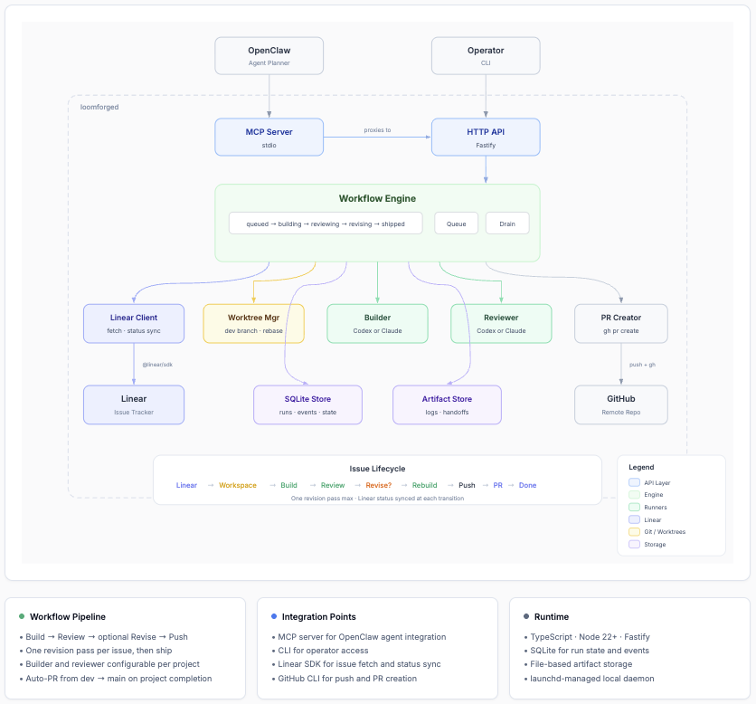

# Loomforge

Loomforge is a local workflow engine that turns Linear issues into shipped code.
It runs an agentic build → review → ship pipeline: fetch the issue, generate
code, review it, and open a pull request — fully unattended.

## Why

I've been running an overnight build pipeline since the early days of OpenClaw.
After brainstorming designs with OpenClaw and Claude during the day, a nightly
cron job would pick up the Linear issues, use Claude to build and Codex to
review, and move issues to Done by morning. It worked — until it didn't.
Breaking changes in Claude's tool use, instability in OpenClaw's ACP protocol,
and fragile skill wiring meant the workflow would silently break every few
weeks. I looked at Paperclip, but it carries too much weight — multi-tenant,
Postgres, plugin marketplace — for what is fundamentally a single-developer
overnight build loop. Loomforge is the lighter, purpose-built replacement:
same pipeline, fewer moving parts, easy to fix when something changes.

## Install

```sh
npm install -g loomforge
```

This installs the `loomforge` CLI and scaffolds `~/.loomforge/` with default config files.

### Prerequisites

- Node 22+
- [Codex CLI](https://github.com/openai/codex) and/or [Claude Code CLI](https://claude.ai/claude-code) — builder and reviewer runners (configurable per project)
- [Linear API key](https://linear.app/settings/api) — issue fetching and status sync

## Setup

### 1. Add your Linear API key

Edit `~/.loomforge/config.yaml`:

```yaml
linear:
  apiKey: lin_api_YOUR_KEY_HERE
```

Or set an environment variable instead:

```sh
export LINEAR_API_KEY=lin_api_YOUR_KEY_HERE
```

### 2. Add a project

Append to the `projects:` list in `~/.loomforge/loom.yaml`:

```yaml
projects:
  - slug: my-project
    repoRoot: /path/to/repo
    defaultBranch: main
    linearTeamKey: TEZ              # required for project-level submission
    linearProjectName: My Project  # Linear project name — filters issues to this project
    builder: codex                 # "codex" or "claude" (default: claude)
    reviewer: claude               # "codex" or "claude" (default: claude)
    verification:
      commands:
        - name: test
          command: pnpm test
        - name: lint
          command: pnpm run lint
```

### 3. Start the daemon

```sh
loomforge start                             # uses ~/.loomforge/loom.yaml
loomforge start --config /other/path.yaml   # custom config
```

### 4. Use the CLI

From another shell:

```sh
loomforge status                        # daemon health check
loomforge submit my-project TEZ-1       # submit a single Linear issue
loomforge submit my-project             # enqueue all actionable issues for a project
loomforge queue                         # list queued/active runs
loomforge get <run-id>                  # get run state and findings
loomforge cancel <run-id>               # cancel a queued run
loomforge retry <run-id>                # retry a failed/blocked run
```

### 5. Install the MCP server

```sh
npx add-mcp loomforge -- loomforge mcp-serve
```

Detects your installed agents (Claude Code, Codex, OpenClaw, Cursor, etc.) and
writes the config for each. Or target specific agents:

```sh
npx add-mcp loomforge -- loomforge mcp-serve -a claude-code -a codex
```

MCP tools: `loom_health`, `loom_submit_run`, `loom_submit_project`, `loom_get_run`,
`loom_get_queue`, `loom_get_project_status`, `loom_cancel_run`, `loom_retry_run`,
`loom_cleanup_workspace`.

### 6. Install the agent skill

```sh
npx skills add tezra-io/loomforge
```

Installs the Loomforge skill to your agent's skills directory. Supports Claude
Code, Codex, Cursor, and [40+ agents](https://github.com/vercel-labs/skills).

## Install from Source

```sh
git clone git@github.com:tezra-io/loomforge.git
cd loomforge
pnpm install
pnpm run build
```

Run locally without a global install:

```sh
pnpm run dev start --config ./loom.yaml
pnpm run dev status
pnpm run dev submit my-project TEZ-1
pnpm run dev queue
```

A default `loom.yaml` is included in the repo root for local testing. Add projects to it as needed.

Or link the CLI globally for development:

```sh
pnpm link --global
loomforge --help
```

## Testing

### Smoke test (no external deps)

```sh
# Terminal 1: start daemon
loomforge start --config ./loom.yaml --port 3777

# Terminal 2: exercise the API
loomforge status
loomforge submit my-project TEZ-1
loomforge queue
loomforge get <run-id>
```

From source without a global link:

```sh
pnpm run dev start --config ./loom.yaml --port 3777
pnpm run dev status
```

### Full run with real runners

Prerequisites: builder and reviewer CLIs authenticated, Linear API key
configured, a test repo with a `dev` branch.

```sh
# 1. Start daemon with a config pointing at a real repo
loomforge start --config ./loom.yaml

# 2. Submit issues
loomforge submit my-project TEZ-1        # single issue
loomforge submit my-project              # all actionable issues

# 3. Watch progress
loomforge queue
loomforge get <run-id>

# 4. When all issues complete, a PR from dev→main is created automatically
```

## Agent Configuration

The Loomforge repo ships `AGENTS.md` (Codex) and `CLAUDE.md` (Claude Code) at the
repo root, automatically discovered when agents run inside this repo.

For projects that Loomforge builds against, the builder prompt instructs Codex to
read the target repo's own `AGENTS.md` / `CLAUDE.md` before making changes.

## System Architecture



## Module Map

| Module | Path | Responsibility |
|--------|------|---------------|
| API | `src/api/` | Local HTTP endpoints for OpenClaw and operator access |
| App | `src/app/` | Daemon bootstrap, launchd lifecycle, service composition |
| CLI | `src/cli/` | Thin operator-facing wrapper over the API |
| Config | `src/config/` | Project registry, YAML config loading, zod validation |
| DB | `src/db/` | SQLite schema, migrations, repositories, event log |
| Linear | `src/linear/` | Linear API client — issue fetching and status sync |
| MCP | `src/mcp/` | MCP server adapter — primary OpenClaw integration |
| Workflow | `src/workflow/` | Run state machine, queue drain, retry/recovery |
| Runners | `src/runners/` | Configurable builder + reviewer (Codex or Claude per project) |
| Worktrees | `src/worktrees/` | Single `dev` branch worktree per project, rebase, cleanup |
| Artifacts | `src/artifacts/` | Prompt/log/result persistence |

## V1 Stack

TypeScript · Node 22+ · Fastify · Commander · MCP SDK · @linear/sdk · SQLite · zod · execa · pino

## Development

```sh
pnpm run build       # compile TypeScript
pnpm run test        # run tests (vitest)
pnpm run lint        # eslint
pnpm run format      # prettier check
pnpm run typecheck   # tsc --noEmit
```
