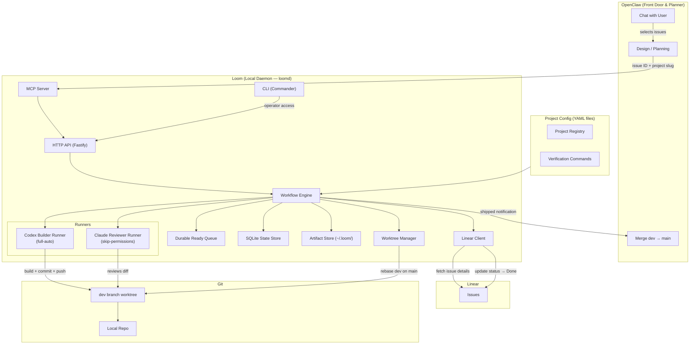
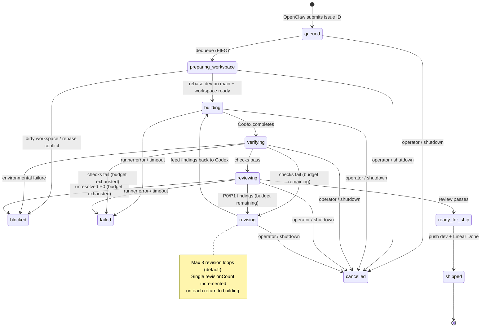
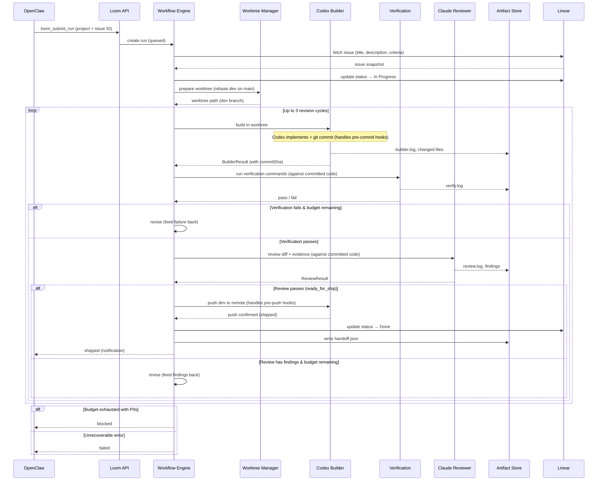
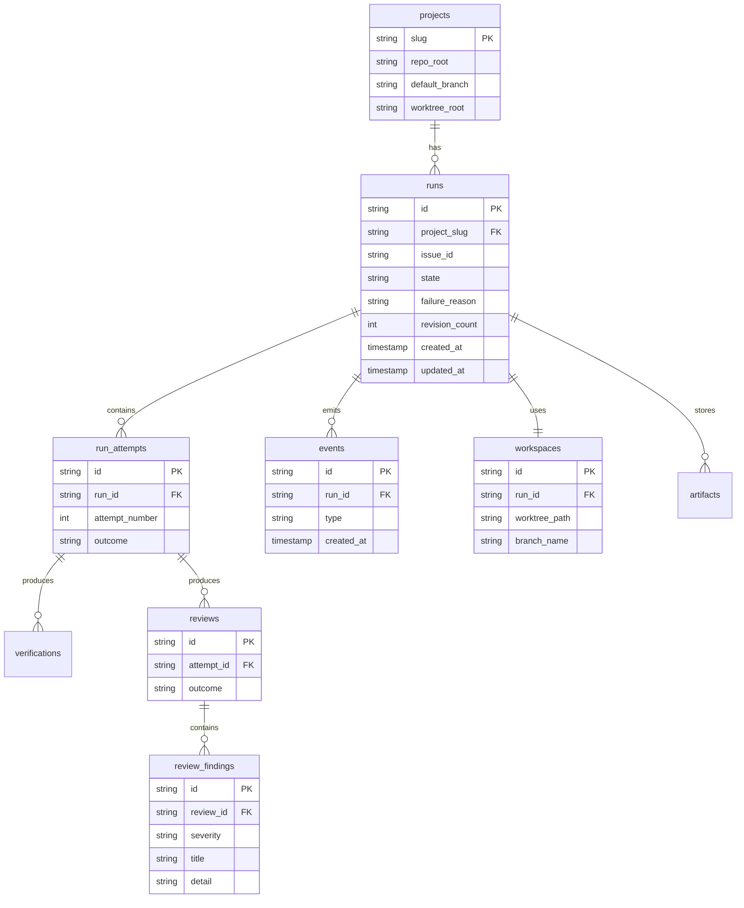
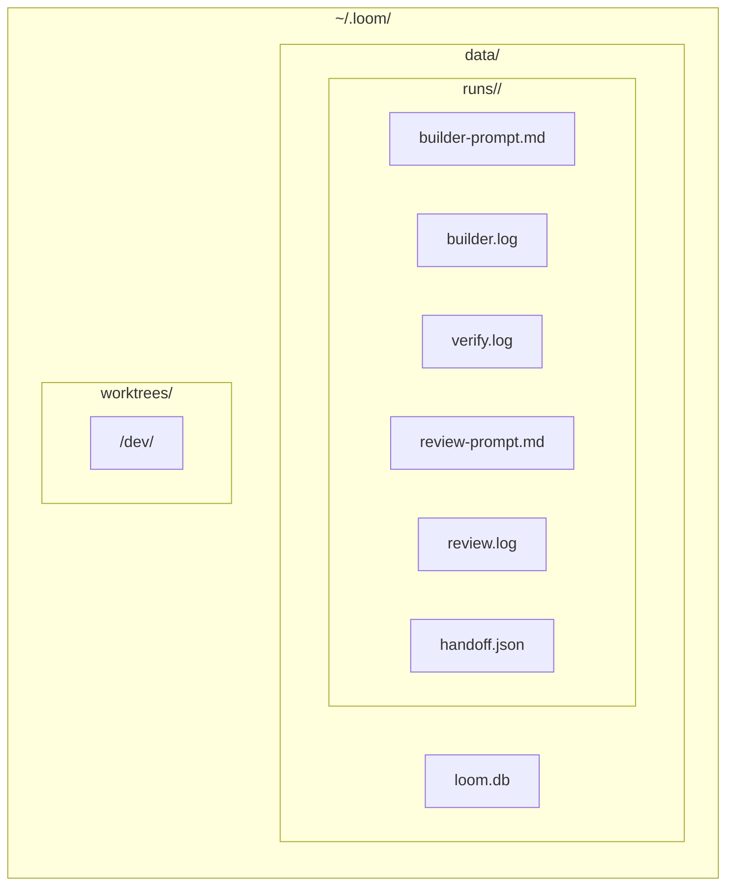

# Loom

Loom is a slim local workflow engine for agentic software delivery.

Goal: keep the parts Sujeeth actually needs from Paperclip, ditch the org-chart/platform overhead, and make design -> build -> review -> ship reliable.

## Current Runnable Shell

The daemon shell is runnable with stub workflow dependencies. It exercises the
HTTP API, CLI, workflow engine, SQLite store, queue drain, and handoff path, but
it does not yet call real Linear, git worktrees, Codex, or Claude.

Create a project registry:

```yaml
runtime:
  dataRoot: .loom-data
projects:
  - slug: loom
    repoRoot: /Users/sujshe/projects/loom
    defaultBranch: main
    verification:
      commands:
        - name: test
          command: pnpm test
```

Start the local daemon:

```sh
pnpm run dev -- start --config ./loom.yaml --port 3777
```

Use the CLI from another shell:

```sh
pnpm run dev -- status
pnpm run dev -- submit loom TEZ-1
pnpm run dev -- queue
```

The next implementation phases replace the stubs with the real verification
runner, worktree manager, Linear client, MCP adapter, and Codex/Claude runners.

## System Architecture



## Workflow State Machine



## Build → Verify → Review Loop



## Data Model



## Runtime Layout



## Module Map

| Module | Path | Responsibility |
|--------|------|---------------|
| API | `src/api/` | Local HTTP endpoints for OpenClaw and operator access |
| App | `src/app/` | Daemon bootstrap, launchd lifecycle, service composition |
| CLI | `src/cli/` | Thin operator-facing wrapper over the API |
| Config | `src/config/` | Project registry, YAML config loading, zod validation |
| DB | `src/db/` | SQLite schema, migrations, repositories, event log |
| Linear | `src/linear/` | Linear API client — issue fetching and status sync |
| MCP | `src/mcp/` | MCP server adapter — primary OpenClaw integration |
| Workflow | `src/workflow/` | Run state machine, queue drain, retry/recovery |
| Runners | `src/runners/` | Codex builder (full-auto) + Claude reviewer (skip-permissions) |
| Worktrees | `src/worktrees/` | Single `dev` branch worktree per project, rebase, cleanup |
| Artifacts | `src/artifacts/` | Prompt/log/result persistence |

## V1 Stack

TypeScript · Node 22+ · Fastify · Commander · MCP SDK · @linear/sdk · SQLite · zod · execa · pino
